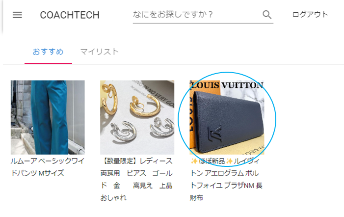
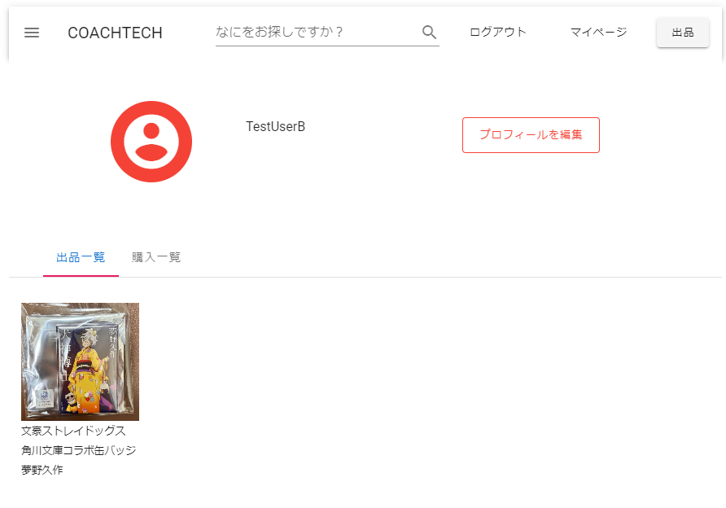
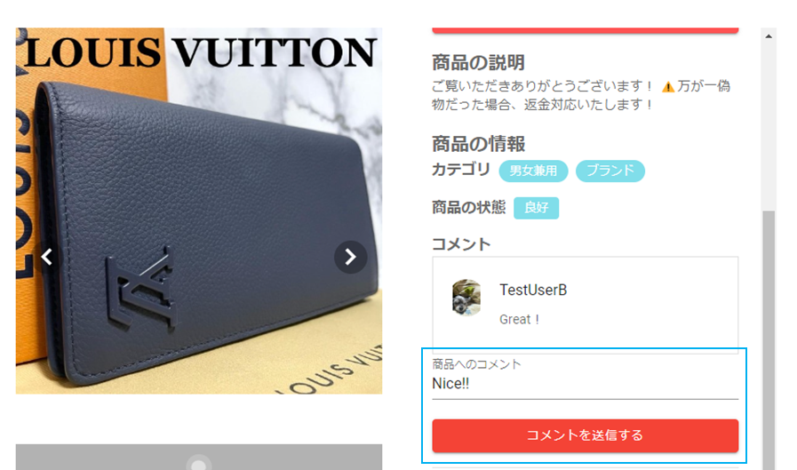

## 概要説明

独自のブランドのアイテムを出品するフリマアプリ

## 機能一覧

会員登録

1. 「会員登録」をクリック（未ログイン時のみ押下可能）  
   

1. Email と password を入力して「登録する」をクリック

- Email：必須
- password：必須,6 桁以上
- 登録後はログイン状態になる

  

ログイン

1. 「ログイン」をクリック（未ログイン時のみ押下可能）  
   

1. Email と password を入力して「ログイン」をクリック

- Email：必須
- password：必須

  

ログアウト

1. 「ログアウト」をクリック（ログイン時のみ押下可能）  
   

1. 完了メッセージが表示されるので「閉じる」をクリック

   

商品一覧取得

1. 「ロゴ」をクリック
1. 商品一覧が表示される

   

 

商品詳細取得

1. 商品一覧画面の画像をクリック  
   

1. 商品詳細が表示される

   

 

ユーザ商品お気に入り一覧取得

1. 「マイリスト」をクリック

   

1. お気に入り一覧が表示される

   

 

ユーザ購入商品一覧取得

1. 「マイページ」をクリック

1. 購入一覧が表示される

   

 

ユーザ出品商品一覧取得

1. 「マイページ」をクリック  
   

1. 出品一覧が表示される

   

 

プロフィール変更

1. 「マイページ」をクリック

   

1. 「プロフィールを編集」をクリック

   

1. 編集が完了したら「更新する」をクリック

   

1. 完了メッセージが表示されるので「閉じる」をクリック

   

商品お気に入り追加

1. 商品一覧画面の画像をクリック  
   

1. 商品詳細画面で ☆ をクリック（ログイン時のみ ☆ 表示）

   

1. お気に入りに登録される

- お気に入り一覧は「マイリスト」から確認できる

  

商品お気に入り削除

1. 商品一覧画面の画像をクリック

   

1. 商品詳細画面で ☆ をクリック （ログイン時のみ ☆ 表示）

   

1. お気に入りから削除される

- お気に入り一覧は「マイリスト」から確認できる

  

商品コメント追加

1. 商品一覧画面の画像をクリック

   

1. 商品詳細画面で コメントマーク をクリック （ログイン時のみ表示）

   

1. コメントマーク欄まで自動でスライドする

   

1. コメントを入力して「コメントを送信する」をクリック

   - コメント入力欄：ログイン時のみ表示
   - コメントボタン：ログイン時のみ表示

     

1. コメントが表示される

   

商品コメント削除

1. コメントを削除ボタンをクリック(自分のコメントの場合のみ表示)

   

1. コメントが削除される

   

出品

1. 「出品」をクリック（未ログインの場合はログインへ）

   

1. 出品する商品情報を入力して、「出品する」ボタンをクリック

- 全項目：必須

  

1. 完了メッセージが表示されるので「閉じる」をクリック

   

購入

1. 商品一覧画面で商品をクリック

   

1. 「購入する」をクリック

   

1. 支払方法、配送方法を確認して「購入する」をクリック

   

1. 完了メッセージが表示されるので「閉じる」をクリック

   

配送先変更

1. 購入画面で「変更する」をクリック

   

1. 郵便番号、住所、建物名を入力して「更新する」をクリック

- 郵便番号：必須、住所自動入力
- 住所：必須

  

## 使用技術（実行環境）

フロントエンド： Nuxt.js,Firebase

バックエンド　： Amazon EC2 (Nginx / Laravel / Mysql ) Amazon S3

- EC2 の Linux 環境 に nginx,php,sql,composer,git をインストールして laravel のプロジェクトをデプロイしました。
- 画像ファイルは S3 に登録するようにしました。

## 動作確認手順

1.  Github からソースをダウンロード
2.  コマンドプロンプトを起動
3.  プロジェクトのディレクトリに移動して、以下のコマンドを実行

            npm install

            npm run dev

※Node.js はインストール済であるとこを前提とします

## テーブル一覧

商品テーブル(goods)

| カラム名   | 型              | 備考 |
| ---------- | --------------- | ---- |
| id         | unsigned bigint |      |
| user_id    | unsigned bigint |      |
| goods_name | string          |      |
| price      | integer         |      |
| condition  | string          |      |
| detail     | string          |      |
| created_at | timestamp       |      |
| updated_at | timestamp       |      |

画像テーブル(images)

| カラム名   | 型              | 備考 |
| ---------- | --------------- | ---- |
| id         | unsigned bigint |      |
| goods_id   | unsigned bigint |      |
| url        | string          |      |
| created_at | timestamp       |      |
| updated_at | timestamp       |      |

お気に入りテーブル(likes)

| カラム名   | 型              | 備考 |
| ---------- | --------------- | ---- |
| id         | unsigned bigint |      |
| user_id    | unsigned bigint |      |
| goods_id   | unsigned bigint |      |
| comment    | string          |      |
| created_at | timestamp       |      |
| updated_at | timestamp       |      |

コメントテーブル(comments)

| カラム名   | 型              | 備考 |
| ---------- | --------------- | ---- |
| id         | unsigned bigint |      |
| user_id    | unsigned bigint |      |
| goods_id   | unsigned bigint |      |
| comment    | string          |      |
| created_at | timestamp       |      |
| updated_at | timestamp       |      |

カテゴリテーブル(categories)

| カラム名   | 型              | 備考 |
| ---------- | --------------- | ---- |
| id         | unsigned bigint |      |
| goods_id   | unsigned bigint |      |
| category   | string          |      |
| created_at | timestamp       |      |
| updated_at | timestamp       |      |

購入テーブル(purchase)

| カラム名       | 型              | 備考 |
| -------------- | --------------- | ---- |
| id             | unsigned bigint |      |
| user_id        | unsigned bigint |      |
| goods_id       | unsigned bigint |      |
| payment_method | string          |      |
| postno         | string          |      |
| address1       | string          |      |
| address2       | string          |      |
| created_at     | timestamp       |      |
| updated_at     | timestamp       |      |

ユーザテーブル(users)

| カラム名   | 型              | 備考 |
| ---------- | --------------- | ---- |
| id         | unsigned bigint |      |
| uid        | unsigned bigint |      |
| email      | string          |      |
| name       | string          |      |
| address1   | string          |      |
| address2   | string          |      |
| postno     | string          |      |
| url        | string          |      |
| created_at | timestamp       |      |
| updated_at | timestamp       |      |

コードテーブル(codes)

| カラム名   | 型              | 備考               |
| ---------- | --------------- | ------------------ |
| id         | unsigned bigint |                    |
| type       | string          | 1：カテゴリ 2.状態  |
| code       | string          |                    |
| value      | string          |                    |
| created_at | timestamp       |                    |
| updated_at | timestamp       |                    |

